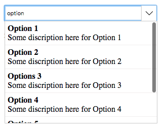

# SlarnAutocomplate
An angular package for a very simple yet powerfull autocomplete component



# Demo
You can find a live demo [here](https://angular-kejswy.stackblitz.io/)

# Installation
1. Run inside your terminal `npm i slarn-autocomplete`<br>
2. Add `SlarnAutocompleteModule` to `app.module.ts`:<br>
```javascript
import { SlarnAutocompleteModule } from 'slarn-autocomplete';

@NgModule({
  declarations: [
    AppComponent
  ],
  imports: [
    BrowserModule, SlarnAutocompleteModule,
  ],
  providers: [],
  bootstrap: [AppComponent]
})
export class AppModule { }
```
3.Now call the component in your template <br>
`<slarn-autocomplete [configurtion]="myConfig" (onItemSelected)="doSomething($event)"></slarn-automplete>`

# Usage
*SlarnAutocomplete* works on two modes:<br>
1. Locally: Filter through explicitly given array of objects
2. Remotely: You just give the url of your api and the autocomplete send a get request to this url with a specific param called `ac-reg` that contains the word written in the autocomplete's input (which means you need to create a function in your api that get the autocomple param and return an array of objects)

And in both cases you need to provide a configuration object to the autocomplete.

# How to configure the autocomplete
Since *SlarnAutocomplete* works on two modes we need to provide a configuration for each one `ACLocalConfiguration` or `ACRemoteConfiguration`

## Working locally
In `app.component.ts`:<br>

```javascript
slarn_local_configuration: ACLocalConfiguration = {
    template: `
      <div><strong>#name#</strong></div>
      <div>#description#</div>
    `,
    key: 'code',
    value: 'name',
    data: [
      {
        code: 'OP1',
        name: 'Option 1',
        description: 'Some discription here for Option 1'
      },
      {
        code: 'OP2',
        name: 'Option 2',
        description: 'Some discription here for Option 2'
      },
      {
        code: 'OP3',
        name: 'Options 3',
        description: 'Some discription here for Option 3'
      }
    ]
};
```
In `app.component.html`:
```html
<slarn-autocomplete 
    [configuration]="slarn_local_config">
</slarn-autocomplete>
```

## Working Remotely:
In `app.component.ts`:<br>

```javascript
slarn_remote_config: ACRemoteConfiguration = {
    template: `
      <div><strong>#name#</strong></div>
      <div>#description#</div>
    `,
    key: 'code',
    value: 'name',
    url: 'path/to/your/api'
};
```
In `app.component.html`:
```html
<slarn-autocomplete 
    [configuration]="slarn_remote_config">
</slarn-autocomplete>
```

# Getting the selected item:
*SlarnAutocomplete* provides a selection event that will be triggered whenever you select an option or clear the autocomplete's input:
```html
<slarn-autocomplete 
    [configuration]="myConfig" (onItemSelected)="doSomething($event)">
</slarn-autocomplete>
```
The selected item will be the full object:
```javascript
doSomething(item: any){
    console.log(JSON.stringify(item));// result: { code: 'OP3', name: 'Options 3', description: 'Some discription here for Option 3' }
}
```
# Setting an item
To pre-select an item you just need to provide it's key to the autocomplete:
```html
<slarn-autocomplete [selectedId]="mySelectedObject.id"></slarn-autocomplete>
```
of course it's based on the key you already gave in the configuration.<br>
If the autocomplete is inside a form then you don't need to use `selectedId` input you jsut need to fill the `formControl`
```html
<slarn-autocomplete formControlName="ac_control"></slarn-autocomplete>
```
in app.component.ts:
```javascript
form.get('ac_control').setValue('myKeyValue');
```

# Available configuration

| Name          | Details|Status|
|---------------|--------|------|
|tempalte       |The html view that you want to be displayed to the user, awesome right :)| Required
|key | Will be stored in the autocomplete (will be used to select an option or when sending a form)|Required
|value| Will be displayed in the autocomplete's input|Required
|input.name|Set a specific name to the input (in case you work with forms and you want a specific name)|Optional
|input.placeHolder|Place holder of the autocomplete|Optional
|loadingText|The text that will be displayed while loading data remotely (you can set a html view)|Optional (default text: `Loading data...`)
|emptyListText|The text that will be displayed when no match found|Optional (default text: `No match found!`)
|data|Contains an array of objects|Required for *Local configuration*
|url|Contains the url of the api |Required for *Remote configuration*

# LICENSE
This project is under MIT License 