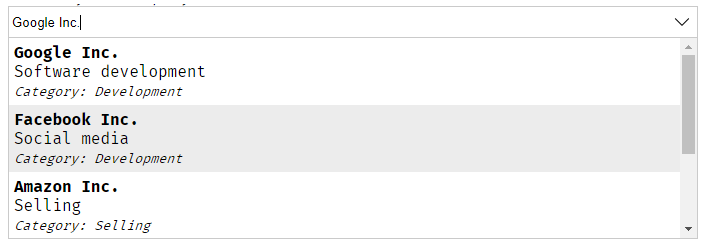
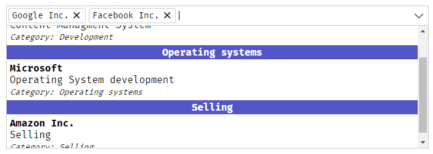
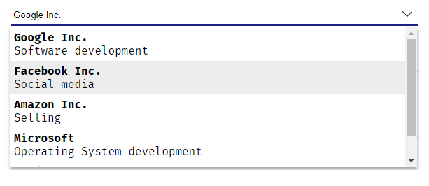
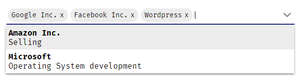

# SlarnAutocomplate
An angular package for a very simple yet powerful autocomplete component

## Default theme
Simple selection           |  Multiple selection (with grouping)
:-------------------------:|:-------------------------:
  |  

## Material design theme
Simple selection            |  Multiple selection
:-------------------------:|:-------------------------:
  |  

# Demo
You can find a live demo [here](https://slarn-autocomplete.stackblitz.io/)

# Installation
1. Run inside your terminal `npm i slarn-autocomplete`<br>
2. Add `SlarnAutocompleteModule` to `app.module.ts`:<br>
```javascript
import { SlarnAutocompleteModule } from 'slarn-autocomplete';

@NgModule({
  declarations: [
    AppComponent
  ],
  imports: [
    BrowserModule, SlarnAutocompleteModule
  ],
  providers: [],
  bootstrap: [AppComponent]
})
export class AppModule { }
```
3. Select a theme:<br>
```css
/*Import material design theme*/
@import '~slarn-autocomplete/themes/material.css';

/*Import default theme*/
@import '~slarn-autocomplete/themes/default.css';
```
##### In case of choosing material design theme:
If you want to change the default bottom border color and animation copy/paste this in the `style.css` file and change the colors as you want:
```css
.slarn-autocomplete-container{
  background-image:
    /* color of the bottom border when animated */
    linear-gradient(to bottom, red, red),
    /* color of the bottom border without animation */
    linear-gradient(to bottom, black, black)
  ;
}
```
4. Now call the component in your template <br>
```html
<slarn-autocomplete 
  [configurtion]="myConfig" 
  (onItemSelected)="doSomething($event)">
</slarn-automplete>
```

# Usage
**SlarnAutocomplete** works on two modes:<br>
1. Locally: Filter through explicitly given array of objects
2. Remotely: You just give the url of your api and the autocomplete send a `GET` request to this url with a specific param called `ac-reg` that contains the word written in the autocomplete (which means you need to create a function in your api that get the autocomplete param and return an array of objects)

And in both cases you need to provide a configuration object to the autocomplete.

# How to configure the autocomplete
Since **SlarnAutocomplete** works on two modes we need to provide a configuration for each one `ACLocalConfiguration` or `ACRemoteConfiguration`

## Working locally
In `app.component.ts`:<br>

```javascript
slarn_local_config: ACLocalConfiguration = {
    template: `
      <div><strong>#name#</strong></div>
      <div>#description#</div>
    `,
    key: 'code',
    value: 'name',
    data: [
      {
        code: 'OP1',
        name: 'Option 1',
        description: 'Some discription here for Option 1'
      },
      {
        code: 'OP2',
        name: 'Option 2',
        description: 'Some discription here for Option 2'
      },
      {
        code: 'OP3',
        name: 'Options 3',
        description: 'Some discription here for Option 3'
      }
    ]
};
```
In `app.component.html`:
```html
<slarn-autocomplete 
    [configuration]="slarn_local_config">
</slarn-autocomplete>
```

## Working Remotely:
In `app.component.ts`:<br>

```javascript
slarn_remote_config: ACRemoteConfiguration = {
    template: `
      <div><strong>#name#</strong></div>
      <div>#description#</div>
    `,
    key: 'code',
    value: 'name',
    url: 'path/to/your/api'
};
```
In `app.component.html`:
```html
<slarn-autocomplete 
    [configuration]="slarn_remote_config">
</slarn-autocomplete>
```

# Getting the selected item:
*SlarnAutocomplete* provides a selection event that will be triggered whenever you select an option or clear the autocomplete's input:
```html
<slarn-autocomplete 
    [configuration]="myConfig" 
    (onItemSelected)="doSomething($event)">
</slarn-autocomplete>
```
The selected item will be the full object:
```javascript
doSomething(item: any){
    console.log(JSON.stringify(item));// result: { code: 'OP3', name: 'Options 3', description: 'Some discription here for Option 3' }
}
```
# Setting an item
To pre-select an item you just need to provide it's key (or an array of keys in case of multiple selection) to the autocomplete:
```html
<slarn-autocomplete [selectedId]="mySelectedObject.id"></slarn-autocomplete>
```
or
```html
<slarn-autocomplete [selectedId]="[1,2]"></slarn-autocomplete>
```
of course it's based on the key you already gave in the configuration.<br>
If the autocomplete is inside a form then you don't need to use `selectedId` input you just need to fill the `formControl` or bind it an `ngModel`
```html
<slarn-autocomplete formControlName="ac_control"></slarn-autocomplete>
```
in app.component.ts:
```javascript
form.get('ac_control').setValue('myKeyValue');
```
or using `ngModel`
```html
<slarn-autocomplete [(ngModel)]="myAttribute"></slarn-autocomplete>
```

# API
## Configuration
### Common configuration
| Name          | Details|Status|
|---------------|--------|------|
|key: `string` | Will be stored in the autocomplete (will be used to select an option or when sending a form)|Required
|value: `string`| Will be displayed in the autocomplete|Required
|template: `string`| The html view that you want to be displayed to the user| Optional
|multiple: `boolean`| Switch between simple or multiple selection|Optional
|name: `string`| Set a specific name to the input (in case you work with forms and you want a specific name)|Optional
|rtl: `boolean`| RTL Support| Optional: (`false` bu default)
|language: `string`| Select the language that will be used in the default texts and console errors<br>Available languages: `en`, `fr` and `ar`<br>**If you don't find your language please feel free to send a pull request for it**| Optional (`en` by default)
|group: `Group`| Group items by a specific field (contains 2 options: `field` and `tempalte`) | Optional
|group.field `Arrow function`| The field that you want to group by, and must be an arrow function ex:<br>`group: { field: item => item.groupAttribute } ` or <br>`group: { field: item => item.subItem.groupAttribute } `| Required
|group.template `string`| The view that you want to be rendered for the group ex:<br> `group:{ template: '<strong>#__group__#</strong>'}`<br>`#__group__#` is where you want to display the group name| Optional

### Local configuration
| Name          | Details|Status|
|---------------|--------|------|
|data: `Array<any>`|Contains an array of objects|Required

### Remote configuration
| Name          | Details|Status|
|---------------|--------|------|
|url: `string`|URL of your API |Required
|minCharacters: `number`|minimal number of characters typed before calling the API |Optional
|loadingView: `string`|The text or the html view that will be rendered while loading data remotely|Optional (default text: `Loading data...`)

### Render `emptyListView`
When there is no data found after typing, **SlarnAutocomplete** will render `No match found!` text .<br>
But if you want to render a template of your own you can use `ng-container` inside `slarn-autocomplete` with `empty-result-view` class:
```html
<slarn-autocomplete
  #firstAutocomplete
  [configuration]="local_config"
  (onItemSelected)="selected_locally = $event">
  <ng-container class="empty-result-view">
    <div style="text-align: center">
      <strong>We can't find what you're looking for!</strong><br>
      <!--As you can see you can render buttons and do some stuff-->
      <!--Of course you need to create the 'addItem()' function in your component-->
      <button (click)="addItem()">Add this new item</button>
    </div>
  </ng-container>
</slarn-autocomplete>
```
## Inputs and Outputs
| Name          | Details|Status|
|---------------|--------|------|
|`@Input`<br>configuration: `ACLocalConfiguration` or `ACRemoteConfiguration`| Contains your custom configuration of the autocomplete| Required
|`@Input`<br>disabled: `boolean`| Disable autocomplete| Optional
|`@Input`<br>unselectable: `Array<string or number>`| Disable some specific items (won't be able to select them) | Optional
|`@Input`<br>selectedId: `any or Array<SelectedItem>`| Contains one or more id of the items that you want to be selected|
|`@Output`<br>onItemSelected: `any`| Event will be fired after selecting an item (`$event` will be the selected item)

## Functions
| Name          | Details|
|---------------|--------|
|`getter`<br>selectedData| Returns selected data (`{}` or `Array<{}>`)
|openSuggestions()| Open the list of suggestions
|closeSuggestions()| Close the list of suggestions
|appendItem(`item`: any, `selectIt`: boolean)<br>`item`: the item that you want to add it<br> `selectIt`: set it to true if you want to select this item after adding it (false by default)| Add items dynamically to the autocomplete **(works only with local configuration)**


# LICENSE
This project is under MIT License 
